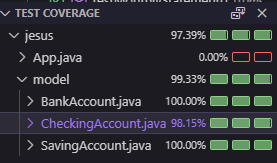

# 🧮 Generador de Tablas de Multiplicar en Java

[](https://www.oracle.com/java/)
[](https://junit.org/junit5/)
[](https://maven.apache.org/)
[](https://github.com/tu-usuario/tabla-multiplicar)


## 📌 Descripción

Clase Java que genera tablas de multiplicar completas (del 1 al 10) con:

- ✅ Formato claro y legible
- ✅ Pruebas unitarias completas
- ✅ 100% de cobertura de código

## 🚀 Comenzando

### Prerrequisitos

- JDK 21
- Maven 3.9.6+
- Git

### Instalación

```bash
git clone https://github.com/tu-usuario/tabla-multiplicar.git
cd tabla-multiplicar
mvn clean install
```

## 📝 Requisitos de implementación

- Clase con método para generar tabla
- Formato exacto: n x i = resultado
- Tests unitarios completos
- Mínimo 70% de cobertura

## 📸 Test Coverage:


