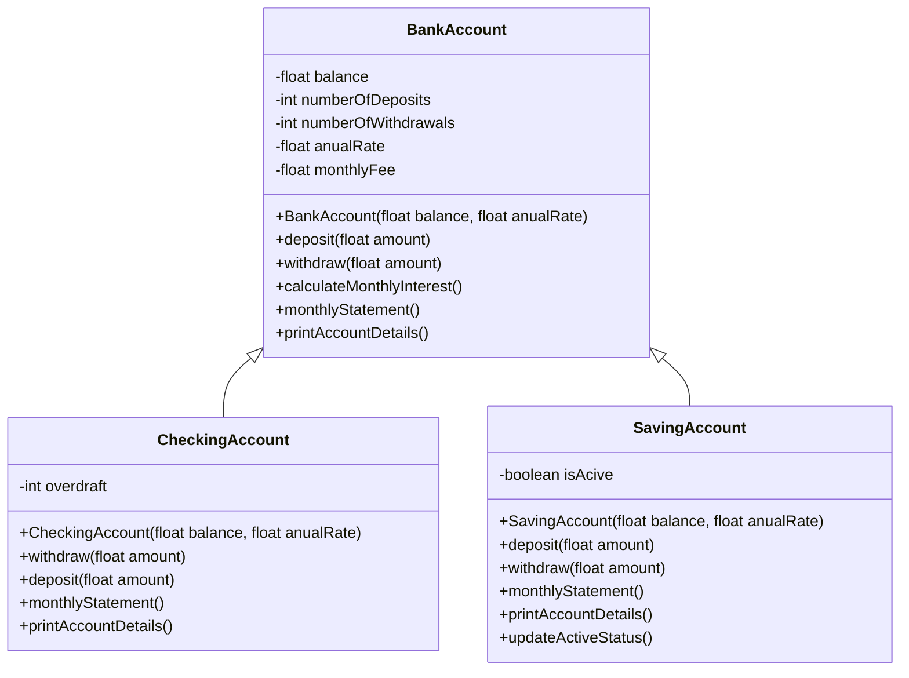
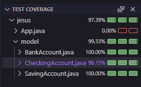

# 🏦 Cuenta bancaria

[](https://www.oracle.com/java/)
[](https://junit.org/junit5/)
[](https://maven.apache.org/)
[](#)

## 📌 Descripción

Programa en Java que modela el comportamiento de una **cuenta bancaria** con herencia y polimorfismo.  
Incluye clases para cuentas de ahorro y cuentas corrientes, con manejo de saldo, retiros, consignaciones, comisiones y sobregiros.

- ✅ Diseño orientado a objetos con herencia
- ✅ Diagrama UML incluido
- ✅ Pruebas unitarias completas
- ✅ Cobertura de código ≥ 70%

## 🚀 Comenzando

### Prerrequisitos

- JDK 21
- Maven 3.9.6+
- Git

### Instalación

```bash
git clone https://github.com/tu-usuario/tabla-multiplicar.git
cd tabla-multiplicar
mvn clean install
```

## 📝 Requisitos de implementación

- Clase **Cuenta** con:
  - Saldo (`float`)
  - Número de consignaciones (`int`, inicial 0)
  - Número de retiros (`int`, inicial 0)
  - Tasa anual (`float`)
  - Comisión mensual (`float`, inicial 0)
- Métodos:
  - `consignar(float cantidad)`
  - `retirar(float cantidad)`
  - `calcularInteresMensual()`
  - `extractoMensual()`
  - `imprimir()`
- **Cuenta de Ahorros**:
  - Activa/inactiva según saldo mínimo $10,000
  - Límite de 4 retiros sin comisión adicional
- **Cuenta Corriente**:
  - Atributo `sobregiro`
  - Permite retiros superiores al saldo
  - Las consignaciones reducen el sobregiro

## 📊 UML



## 📸 Test Coverage

  
_(captura de VSCode)_
